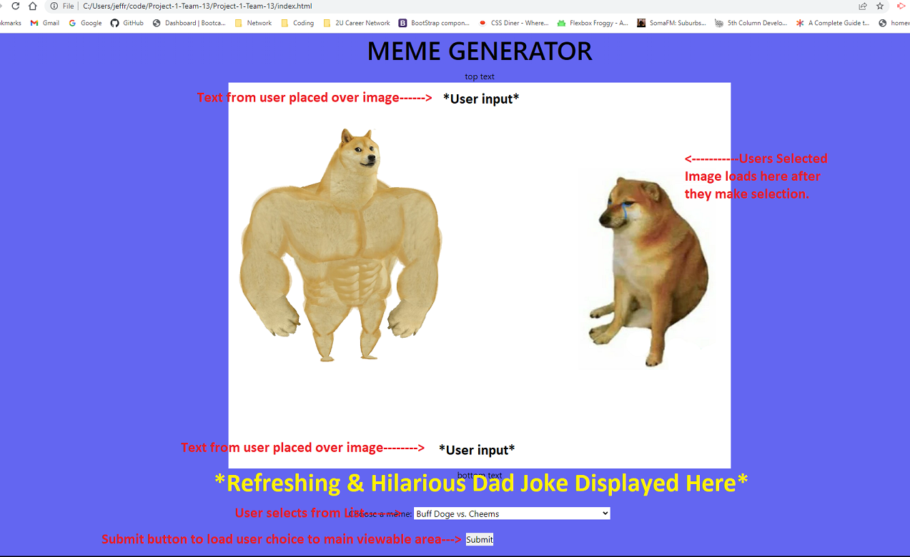

# Project-1-Team-13 Meme Generator

## Project Outline
Customer wants a way to drive traffic to their website. A meme generator with daily jokes fullfills this objective.

## AS A USER:
I want to be albe to select a recent trending meme and insert my own punchline, as well as have a fresh joke for the watercooler.

## THE PROJECT IS FINISHED WHEN: 

AS A USER: When I go to the webpage I am able to pick from a selection of recent, trending memes.
AS A USER: After selecting the meme I wish to create, I can enter my custom comments to the meme.
AS A USER: I want a fresh short and silly joke available to break the ice with clients and around the watercooler.

## The APIs used to create the page will be:

-[Imgflip API](https://imgflip.com/api) Will be used to source the meme content.

-[icanhazdadjoke](https://icanhazdadjoke.com/api) Will be used to source the jokes.

## Styling

-The site will be styled using the CSS framework [Tailwind](https://tailwindcss.com/)

## Wireframe 

